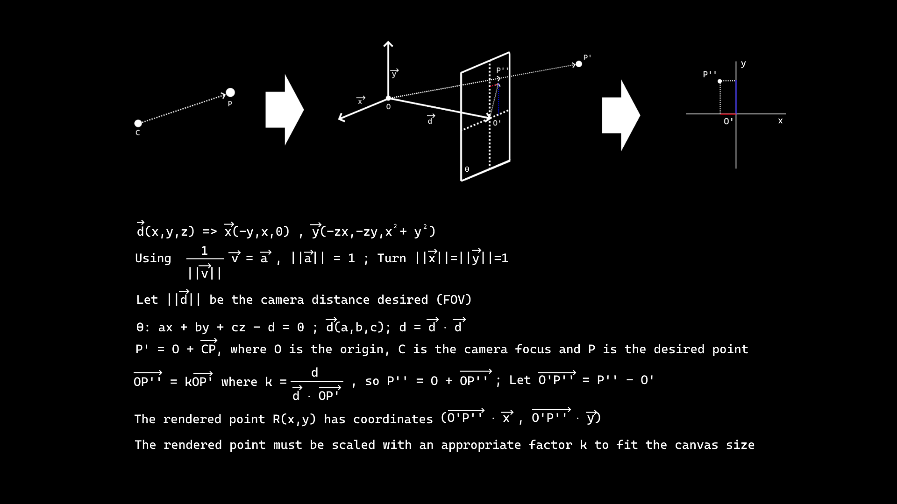

# Overview
This was a summer project that arose from the questions:

* How would I build a very basic 3D renderer without previous knowledge?
* How could I simulate orbits numerically? 

This was my (naïve and experimental) solution. Not all the planned functionalities are working (settings and creating worlds).<br />
DISCLAIMERS: The code isn't very tidy. Nonetheless, it serves as a simple example of 3D graphics and basic physics. The classes are all in .h files (I was experimenting to see if it'd be better than doing cpp and h (spoiler: it's not)).


# The Renderer

The 3D Renderer was built using the usual cross and dot products in R^3 and some geometric trickery, as seen in the image below.<br />
To render the planets I simply render two points: One along the center and another in the radius of the planet, and bind the image to that section.<br />
The planets are sorted (quicksort) in terms of distance before rendering.<br />




# Worlds

The program comes with a `file manager` to save and load files, as well as a simple script for the world save files.<br />
The scripts are contained in a world.dat file inside the world folders, which the program detects and considers valid.<br />
To make new worlds simply copy an existing preset worlds and feel free to edit the world.dat!<br />
Here are the world 'scripts':<br />

Camera Center Position (x,y,z)<br />
```
camera_center x y z
```
Camera Angles xAngle->\[-pi,pi\] yAngle->\[-pi/2,pi/2\]:<br />
```
camera_angles xAngle yAngle
```
Planet informations (the planet texture must be 0 because not all functionalities were added, as previously mentioned):<br />
```
planet_colour R G B
planet_position X Y Z
planet_velocity Vx Vy Vz
planet_mass M
planet_radius R
planet_texture 0
```
Create a planet (with previously stated information about the planet):<br />
Note: You can create multiple copies of a planet by 'spamming' create_planet.<br />
```
create_planet
```

I have also implemented a `python` script to generate a random world. Just run `rand_world.py` and the world information will be added to `random.dat`


# The Physics

The orbits are calculated using [Newton's Law of Gravitation](https://en.wikipedia.org/wiki/Newton%27s_law_of_universal_gravitation), the simplest way to describe gravity:<br />
$F = G{m*M \over r^2}$<br />
F: generated gravitational force (Newton)<br />
m: mass of object 1 (Kilogram)<br />
M: mass of object 2 (Kilogram)<br />
G: constant of gravitation (m^3s^-2kg^-1)<br />
r: distance between centers of mass (Meters)<br />


The implementation is far from rigorous, but it serves it's purpose.<br />
Naturally I did not solve any complicated analytical expressions, that would be quite impossible for more than two bodies if not for some special cases.<br />
What I did is simply, for small `dt`, which I will call a `time step` - The change of position is calculated from the velocity `v*dt`, which changes according to the acceleration `a*dt` which is obtained from the famous `F=ma` and the formula shown before.<br />
This is a mere numerical approximation to the 'real thing' - [Euler's Method](https://en.wikipedia.org/wiki/Euler_method).<br />
Despite it's pompous name, it should be very natural and familiar for anyone who has played video-games before (in fact, I didn't know the name of this procedure when making the project, it's simply intuitive).<br />


# Make the damn thing run!

The program might not work right away, You'll need to link SDL2main and SDL2image, as well as dll files (Windows).<br />

# Enjoy!!
